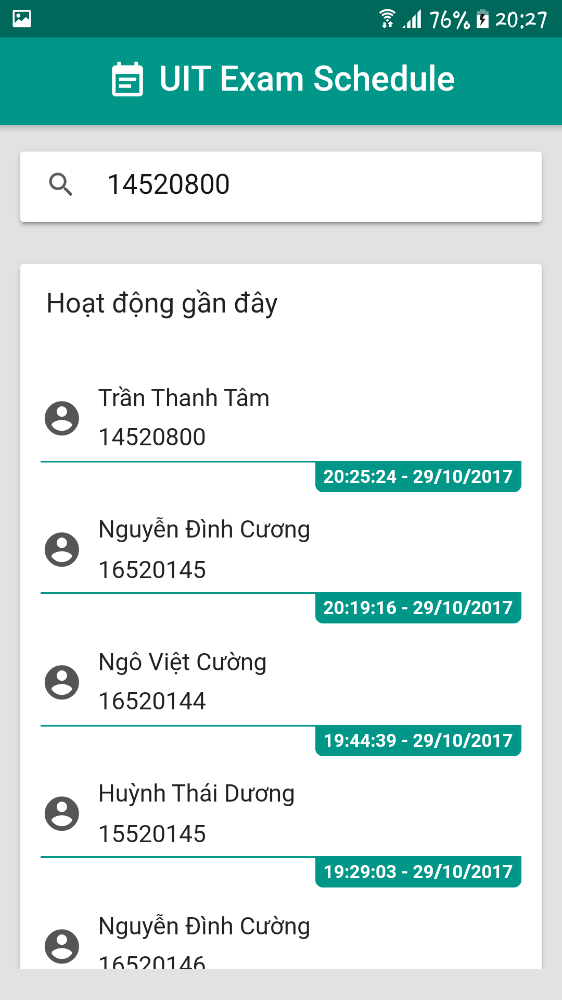
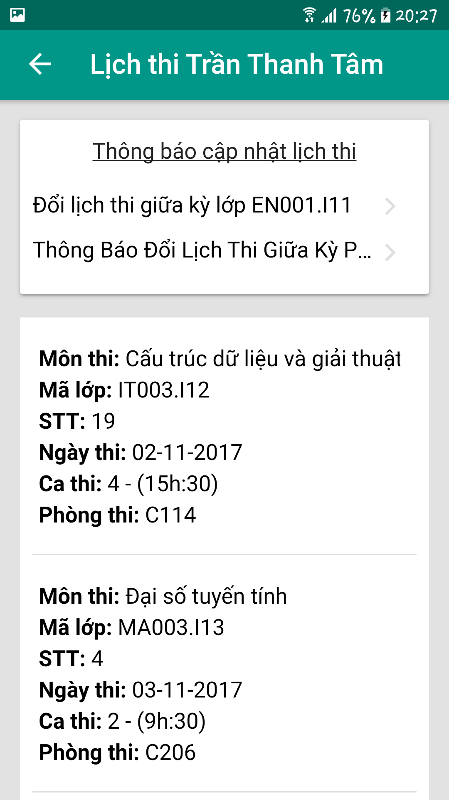
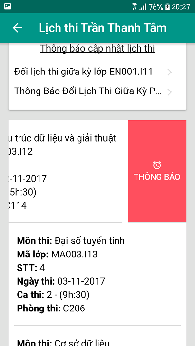
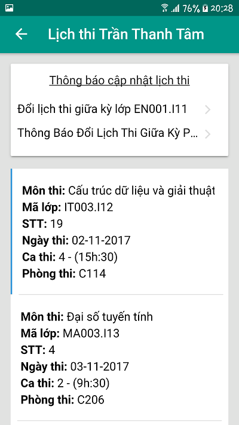
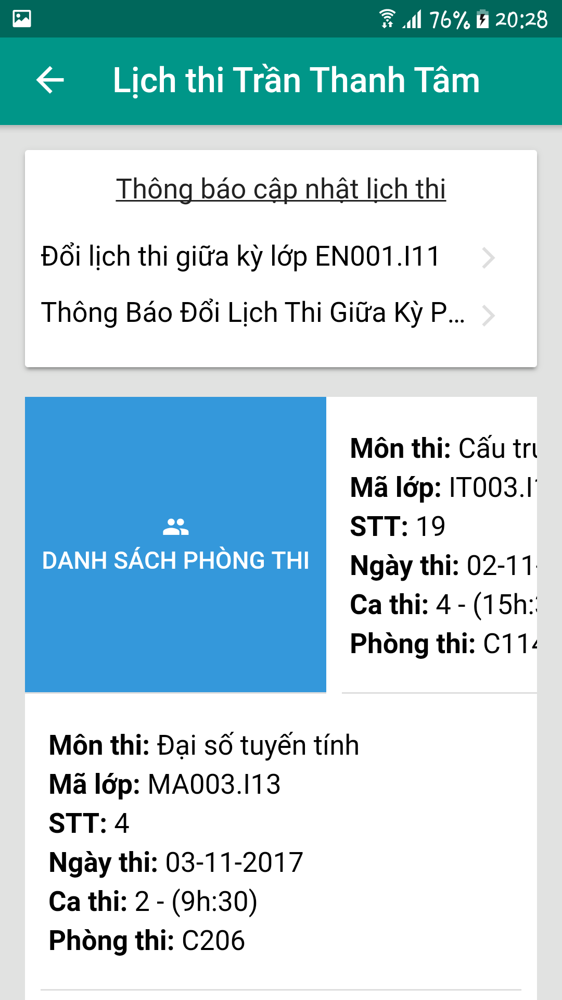
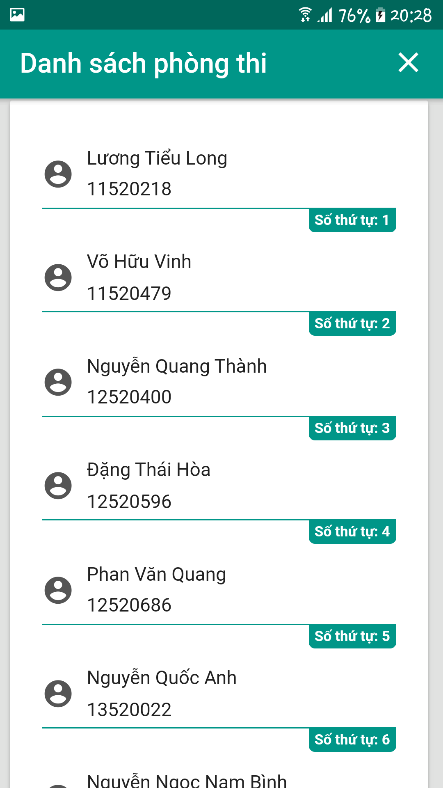
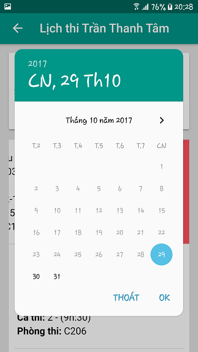
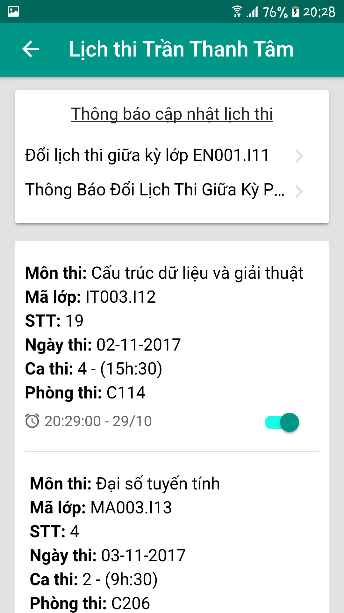

# ScreenShot

# ReadMore and fixbug:
https://github.com/katzer/cordova-plugin-local-notifications/issues/1325
https://stackoverflow.com/questions/33981901/ionic-build-android-throws-uh-oh-error-after-updating-cordova
https://github.com/ionic-team/ionic-cli/issues/2454
https://forum.ionicframework.com/t/how-to-install-all-my-codrova-plugins-listed-in-package-json/21328/5
https://github.com/katzer/cordova-plugin-local-notifications/issues/1345
https://github.com/katzer/cordova-plugin-local-notifications/wiki/03.-Installation
https://stackoverflow.com/questions/32120611/phonegap-local-notification-plugin
